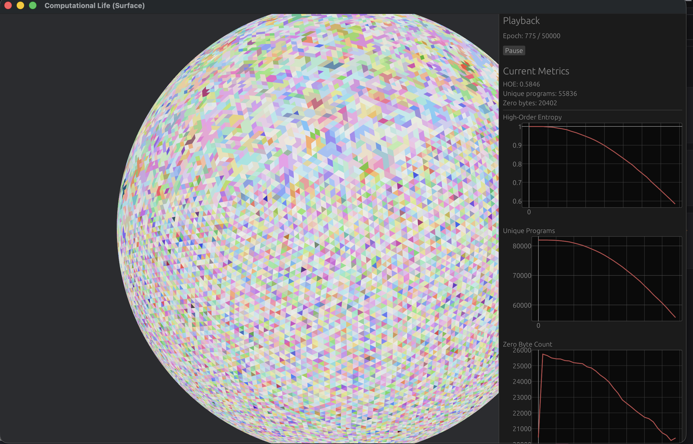
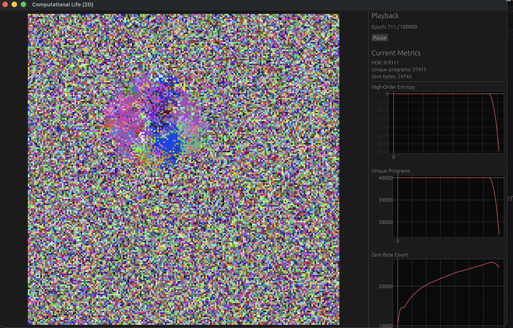
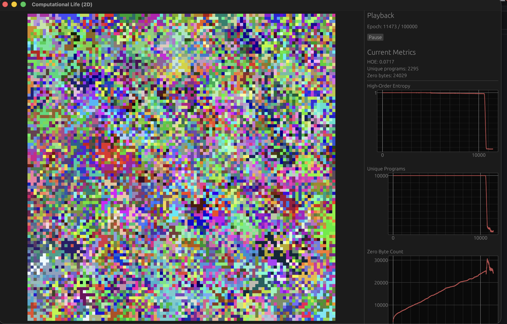
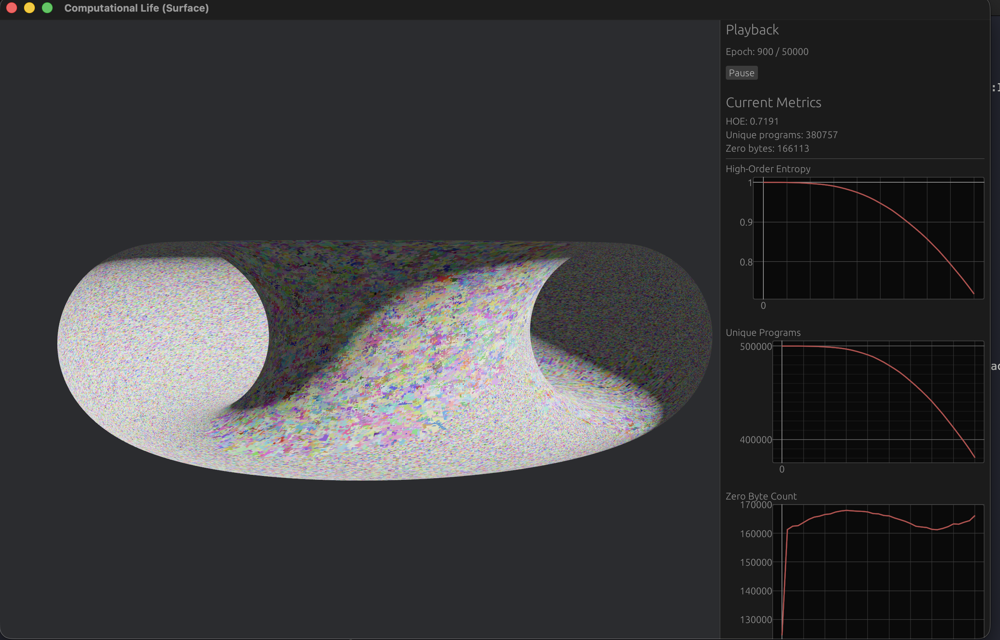
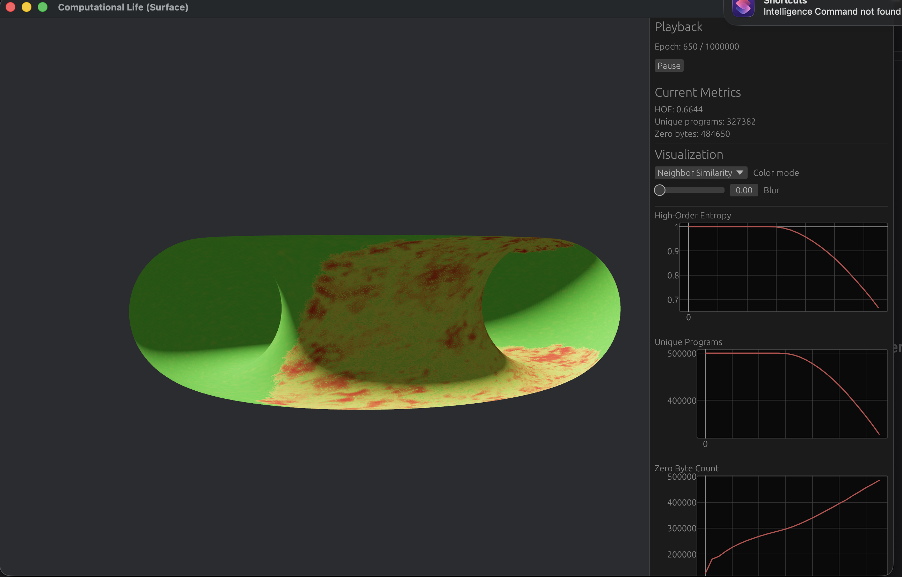
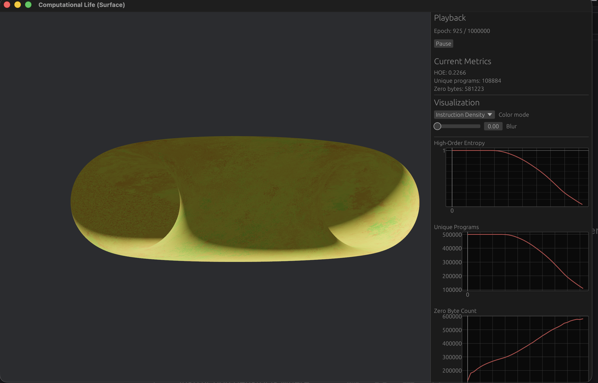
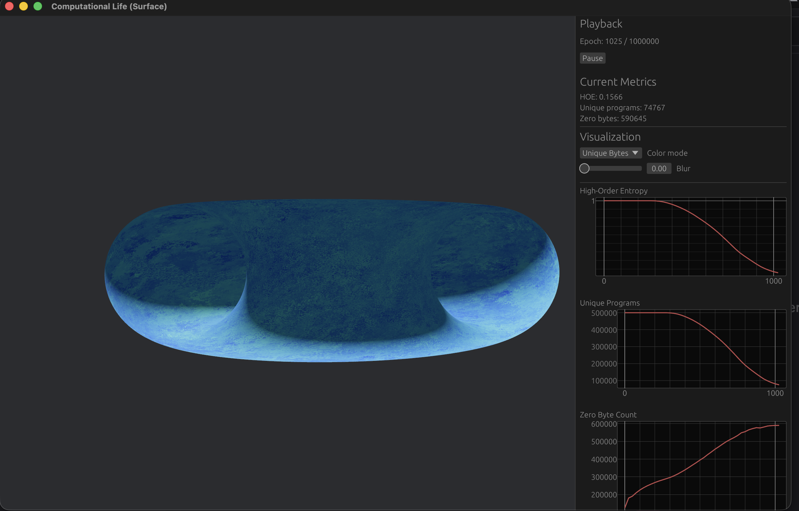

# Computational Life

This is an independent reproduction of the paper
[**Computational Life: How Well-formed, Self-replicating Programs Emerge from Simple Interaction**](https://arxiv.org/abs/2406.19108)
by Blaise Ag​üera y Arcas, Jyrki Alakuijala, James Evans, Ben Laurie,
Alexander Mordvintsev, Eyvind Niklasson, Ettore Randazzo, and Luca Versari
(Google, Paradigms of Intelligence Team & The University of Chicago).

All credit for the ideas, experimental design, and instruction sets goes to the
original authors. This project exists purely as an exercise in scientific
curiosity — we found their work fascinating and wanted to watch self-replicators
emerge with our own eyes.

<p align="center">
  
</p>

Programs are random byte strings that execute against each other. Two programs
are concatenated, run through an instruction set interpreter, and the modified
tape is split back — allowing programs to read, overwrite, and replicate into
their neighbors. Over thousands of epochs, replicators emerge, compete for
space, and drive down the entropy of the population.

## Gallery

| 2D grid — early spatial clustering | 2D grid — late stage diversity |
|:---:|:---:|
|  |  |

| Surface simulation on a torus |
|:---:|
|  |

### Visualization modes

The default **Hash** view assigns each program an RGB color derived from a hash
of its bytes. Identical programs get the same color, so you can watch replicators
flood a region — but the colors are arbitrary, and two very similar programs may
hash to completely different hues. The alternative color modes map meaningful
properties of each program onto the surface, letting you explore the structure
that replicators actually carry:

| Neighbor Similarity | Instruction Density | Unique Bytes |
|:---:|:---:|:---:|
|  |  |  |

- **Neighbor Similarity** — colors each cell by the average Hamming distance to
  its geodesic neighbors. This is perhaps the most striking mode: you can watch
  replicators spread like a virus across the surface, with uniform green
  territories expanding outward and red/brown fault lines marking where different
  species collide.

- **Instruction Density** — the fraction of bytes that decode as valid
  instructions rather than NOPs or junk. As structure emerges, the distribution
  shifts visibly — though not always in the direction you'd expect, since
  successful replicators don't necessarily use a high proportion of the
  instruction set.

- **Unique Bytes** — the number of distinct byte values present in each program.
  Replicators show obvious structure here: conquered regions become noticeably
  more uniform compared to the random primordial soup, though the specific
  patterns vary.

These are just a few of the available color modes — there are others in the
viewer not shown here. They are all exploratory tools. We don't know many
generalizable properties of replicators beyond the fact that they clearly
reduce entropy and show emergent structure across all of these views. The point
is to give you more angles to watch the dynamics unfold and form your own
intuitions about what's happening.

## Features

- **Nine instruction sets** spanning fundamentally different computational paradigms:

  | Substrate | Model | Replicator | Origin |
  |-----------|-------|--------:|--------|
  | BFF | Pointer machine with bracket loops | ~5 bytes | Paper |
  | Forth | Stack machine with relative jumps | 1 byte | Paper |
  | SUBLEQ | Single-instruction, absolute addressing | 60 bytes | Paper |
  | RSUBLEQ4 | Single-instruction, relative addressing | 25 bytes | Paper |
  | **Qop** | Queue / FIFO pipeline | 3 bytes | Novel |
  | **Skim** | Skip-chain (data = control flow) | 64 bytes | Novel |
  | **Rig** | Register-indirect (Von Neumann) | 4 bytes | Novel |
  | **Bits** | Bit-serial (sub-byte granularity) | 4 bytes | Novel |
  | **Echo** | Delay-line memory (write = read + delay) | 3 bytes | Novel |

- **Multiple topologies**: flat grid, icosphere, torus, and hamster tunnel —
  all with geodesic neighborhoods
- **Live 3D visualization** via Bevy with real-time metrics (high-order entropy,
  unique program count, zero-byte count) and multiple color modes
- **Deterministic** — seeded RNG for full reproducibility
- **Fast** — geometric-skip mutation, parallel surface epochs via Rayon

## Quick start

```bash
cargo run --release
```

This launches the interactive viewer where you can configure the substrate,
surface topology, mutation rate, and all other parameters from the menu before
starting the simulation.

## How it works

1. **Initialize** a population of random byte-string programs
2. **Each epoch**: every program interacts with a neighbor — two programs are
   concatenated, executed by the chosen instruction set, and the result is
   split back into the two slots
3. **Mutate**: random bit-flips at a low per-byte rate (geometric skip for
   efficiency)
4. **Measure**: high-order entropy (brotli compression ratio) tracks whether
   structure is emerging in the population

When replicators arise, they copy themselves into neighbors, collapsing
entropy and driving up the count of identical programs. Different instruction
sets and topologies produce qualitatively different evolutionary dynamics.

## References

> Blaise Ag​üera y Arcas, Jyrki Alakuijala, James Evans, Ben Laurie,
> Alexander Mordvintsev, Eyvind Niklasson, Ettore Randazzo, Luca Versari.
> *Computational Life: How Well-formed, Self-replicating Programs Emerge
> from Simple Interaction.* arXiv:2406.19108, 2024.
> https://arxiv.org/abs/2406.19108
